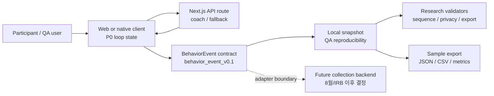

# Startio Research v0.1 Backend Architecture Boundary

- 기준일: 2026-06-09
- 단계: Data Contract / Backend Boundary
- 목적: Research v0.1 Freeze Candidate에서 client, API route, behavior event, validator, sample export, 향후 운영 수집 backend의 책임 경계를 고정한다.
- 문서 구조: `docs/research/README.md`

## 1. 한 줄 결론

2026-07-31까지 필요한 백엔드 아키텍처 작업은 운영용 데이터베이스, 인증, 연구자 dashboard를 완성하는 것이 아니다. 지금 필요한 것은 P0 loop가 남기는 행동 이벤트를 어떤 경계로 생성, 검증, export, 이후 수집 backend에 연결할지 정의하는 것이다.

## 2. Architecture scope



이 그림의 핵심은 저장소가 무엇이든 `BehaviorEvent` 계약이 먼저 고정되어야 한다는 점이다. 7.31 Freeze Candidate는 `Future collection backend`를 실제 운영 수집 시스템으로 완성하지 않는다.

## 3. Component responsibility

| 구성요소 | 7.31 책임 | 하지 않는 일 |
| --- | --- | --- |
| Client / P0 loop | task, plan, timer, proof, EXP, history 상태를 만들고 `BehaviorEvent`를 생성한다 | 원문 과업, 직접 식별정보, 진단/상담 원문을 event/debug/export에 저장하지 않는다 |
| Next.js API route | coach/plan/chat 요청과 fallback 응답을 처리한다 | provider raw response, raw prompt, API request body를 behavior event로 저장하지 않는다 |
| Behavior event contract | session/task/plan/step 단위의 canonical payload를 정의한다 | 특정 DB vendor나 dashboard UI에 종속되지 않는다 |
| Local snapshot | QA 재현과 sample export 생성을 위한 검수용 저장 경로로 사용한다 | 실제 연구 운영 데이터 수집 저장소로 주장하지 않는다 |
| Validators | event sequence, privacy, fallback, proof/EXP idempotency, export field를 검증한다 | 실패를 숨기거나 fixture만 맞추기 위해 schema를 완화하지 않는다 |
| Sample export | 연구자/IRB 검수용 `sample-events.json`, `sample-events.csv`, `sample-metrics.json`을 생성한다 | 실참여자 원문 로그나 직접 식별정보를 포함하지 않는다 |
| Future collection backend | 8월/IRB 이후 운영 수집 adapter 후보로 남긴다 | 7.31 전에 dashboard/auth/database/data retention/permissions 전환을 P0 완료 조건으로 만들지 않는다 |

## 4. Data flow contract

| 단계 | 허용 데이터 | 금지 데이터 | 검증 |
| --- | --- | --- | --- |
| Task input -> plan request | 사용자가 입력한 과업을 plan 생성을 위해 일시 사용 | event/export/debug field에 raw task text 저장 | privacy validator |
| API response -> plan | barrier type, task category, first action, 3-step plan metadata | provider raw response, prompt transcript | fallback/copy QA |
| Timer/proof -> event | `session_id`, `task_id`, `plan_id`, `step_id`, `step_index`, `assigned_step_count`, timer/proof fields | 자유 입력 원문, 사진/문서 원본, 민감정보 | P0 event sequence validator |
| Event -> local snapshot | 비식별 behavior event | 직접 식별정보, 진단/치료/상담/약물 정보 | storage/privacy validator |
| Snapshot -> sample export | sample events JSON/CSV, sample metrics JSON | raw input, API raw payload, PII | export validator |
| Event -> future backend | adapter-ready canonical event | backend 전용 임의 필드로 오염된 event | adapter contract review |

## 5. Validator gates

Backend boundary는 아래 validator가 같은 event/export 계약을 바라보게 만드는 것을 목표로 한다.

| validator | 검증 대상 |
| --- | --- |
| schema validator | 필수 필드, enum, timestamp, `schema_version` |
| sequence validator | happy path, abandon path, fallback path 순서 |
| session lifecycle validator | `app_opened`, `session_started`, `session_resumed`, `session_ended` 연결 |
| task/plan/step integrity validator | `task_id`, `plan_id`, `step_id`, `step_index`, `assigned_step_count=3` |
| time integrity validator | timestamp 역전, 음수 duration, 비정상 latency |
| proof/EXP duplicate validator | 같은 task/plan에서 proof/EXP 1회 |
| privacy validator | raw input, PII, diagnosis, counseling text 없음 |
| fallback validator | `remote_timeout`, `api_error`, `fallback_used`, safe `debug_reason` |
| export validator | `sample-events.json`, `sample-events.csv`, `sample-metrics.json` 필드 일치와 금지 필드 부재 |

## 6. Required adapter boundary

향후 backend 저장소가 정해져도 아래 adapter boundary는 유지한다.

```ts
type ResearchEventSink = {
  writeEvent(event: BehaviorEvent): Promise<void>
  readEvents(query: {
    participantCodeHash?: string
    sessionId?: string
    taskId?: string
  }): Promise<BehaviorEvent[]>
}
```

7.31 기준 구현은 local snapshot과 sample export를 대상으로 해도 된다. 다만 code/data contract는 향후 `ResearchEventSink` 같은 얇은 adapter 뒤로 옮길 수 있어야 한다.

## 7. Fallback and reliability boundary

Native fallback 빈발 이슈는 backend architecture에서 반드시 따로 해석 가능해야 한다.

| 상태 | event | 해석 |
| --- | --- | --- |
| remote success | `action_plan_generated` with `coaching_plan_source=openai` | remote path 정상 |
| timeout | `remote_timeout` + `fallback_used` | network/backend/provider 지연 |
| API failure | `api_error` + `fallback_used` | non-2xx, invalid response, request failure |
| local fallback | `fallback_used` with safe `debug_reason` | 사용자는 P0 loop를 계속 진행 |

`debug_reason`은 reason code만 저장한다. 사용자 입력, provider 원문, stack trace는 저장하지 않는다.

## 8. Freeze Candidate acceptance

Backend architecture boundary는 아래가 충족될 때 7.31 후보본 범위에서 완료로 본다.

1. `BehaviorEvent` target field와 lifecycle event가 문서와 코드에서 일치한다.
2. local snapshot과 sample export에 금지 데이터가 없음을 validator로 확인한다.
3. timeout/API error/fallback이 별도 event로 구분된다.
4. sample export만으로 KPI 재계산이 가능하다.
5. future collection backend는 adapter boundary와 금지 데이터 원칙까지만 문서화한다.
6. 연구자/기관 dashboard, auth, production DB migration은 8월/IRB 이후 범위로 남긴다.
7. data retention, permissions, operational storage policy는 8월/IRB 이후 운영 문서에서 확정한다.

## 9. Additional design needed before implementation

Roadmap대로 `R04 -> R04a -> R05/R10 -> R09`를 진행하려면 아래 세부 설계를 추가로 닫아야 한다.

| 설계 항목 | 먼저 결정할 것 | 연결 작업 | 완료 기준 |
| --- | --- | --- | --- |
| Event identity model | `session_id`, `task_id`, `plan_id`, `step_id`를 어디서 생성하고 어떤 화면/이벤트에 전달할지 | R04, R05 | 같은 P0 loop의 task/plan/step 이벤트가 같은 ID로 묶인다 |
| Session lifecycle model | `app_opened`, `session_started`, `session_resumed`, `session_ended` 발생 조건과 reload/back/reentry 처리 | R04, R07 | session event 없이 task/timer event가 생기지 않는다 |
| Local snapshot schema | localStorage snapshot의 schema version, migration, reset, QA seed 정책 | R04a, R05 | 검수용 snapshot이 event/export와 같은 계약을 사용한다 |
| API boundary contract | plan/chat route의 request/response sanitize, timeout, error, fallback reason code | R04a, R10 | raw request/response가 event/export/debug field에 저장되지 않는다 |
| Event sink adapter shape | `ResearchEventSink`의 client/local implementation 위치와 future backend 교체 지점 | R04a, R09 | 저장소가 바뀌어도 `BehaviorEvent` payload는 유지된다 |
| Validator runner design | validator 입력, fixture, 실패 메시지, CI/manual 실행 명령 | R05, R10 | sequence/privacy/fallback/export validator가 같은 sample을 검증한다 |
| Export package shape | `sample-events.json`, `sample-events.csv`, `sample-metrics.json`, `sample-export-readme.md` 필드와 생성 명령 | R09 | 연구자/IRB가 export만 보고 수집/비수집 데이터와 KPI 산식을 검수한다 |
| Privacy scan policy | 금지 key, 금지 pattern, debug field 검사 범위, false positive 처리 | R02, R05, R09 | raw input/PII/진단/상담 원문이 snapshot/export/debug에 없음을 증명한다 |
| Fallback observability | `remote_timeout`, `api_error`, `fallback_used`, `debug_reason`, optional `http_status`의 조합 규칙 | R10 | fallback 빈도와 원인을 raw text 없이 분리할 수 있다 |
| August handoff boundary | auth, permissions, data retention, production DB, collection backend를 어떤 문서로 넘길지 | R12 이후 | 7.31 산출물에 운영 backend 구현을 끌어들이지 않는다 |

## 10. Recommended design order

추가 설계는 아래 순서로 닫는다.

1. Event identity + session lifecycle: 코드 변경의 기준축이다.
2. Local snapshot + event sink adapter: 현재 localStorage와 future backend 사이의 책임선을 만든다.
3. API sanitize/fallback reason code: native fallback 리스크를 해석 가능하게 만든다.
4. Validator runner + privacy scan: R04/R04a가 지켜지는지 자동으로 확인한다.
5. Export package shape: 연구자/IRB 검수 산출물로 변환한다.
6. August handoff boundary: 운영 수집, 권한, 보관/폐기 정책을 7.31 범위 밖으로 안전하게 넘긴다.

## 11. Related documents

| 문서 | 연결 |
| --- | --- |
| `docs/research/behavior-event-data-dictionary.md` | event field와 enum의 canonical 정의 |
| `docs/research/safety-copy-boundary.md` | 금지 문구와 금지 데이터 |
| `docs/research/fallback-qa-history.md` | fallback 로그 부재와 재검증 필요성 |
| `docs/research/qa-scenarios.md` | validator와 QA evidence 형식 |
| `docs/dev/research-v0.1-implementation-roadmap.md` | `R04a Backend architecture boundary` 구현 순서 |
